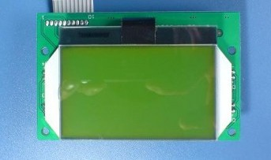

# Gphone_LCD
[Arduino] Gphone_GLCD_SPI_128_64 library for VBLUno boards of VNG



## Hardware connection

| Ord 	|   GLCD_PIN  	| VBLUno_PIN 	|
|:--:	|:-------:	|:-----------------------:	|
|  1 	|   GND   	|           GND           	|
|  2 	|   /RST  	|          +3.3V          	|
|  3 	|   SCK   	|            **13**           	|
|  4 	| AO(C/D) 	|            **12**           	|
|  5 	|   LEDA  	|          +3.3V          	|
|  6 	|   LEDK  	|           GND           	|
|  7 	|   SDA   	|            **11**           	|
|  8 	|   /CS   	|            **10**           	|
|  9 	|   VCC   	|          +3.3V          	|
| 10 	|   GND   	|           GND           	|


## API functions:

```
/*  
* @brief  Init for SPI GLCD
* @params CS_: CS pin on VBLUno
* @params SCK_: SCK pin on VBLUno
* @params SDA_: SDA pin on VBLUno
* @params AO_: AO pin on VBLUno
* @params GRAPHIC_MODE_: GLCD Mode
* 0: Text mode
* 1: Graphic mode (not support in this library)
*/
void InitLcd(int CS_, int SCK_, int SDA_, int AO_, int GRAPHIC_MODE_);

/*  
* @brief  Test function
*/
void TestLcd(void);

/*  
* @brief  Clear all screen
*/
void ClearLcd(void);

/*  
* @brief  Print a string on screen
* @params row: 0-7
* @params col: 0-20
* @params stringdata: a string (1 to 21 character)
* @note   Size of stringdata is not greater than 21 character
*/
void PrintLcd(int row, int col, char* stringdata);

/*  
* @brief  Print a string on screen
* @params row: 0-7
* @params col: 0-20
* @params num: integer number
*/
void PrintIntLcd(int row, int col, int num);

/*  
* @brief  Print a string on screen
* @params row: 0-7
* @params col: 0-20
* @params doublenum: double number
* @note   precision is %0.4f
*/
void PrintFloatLcd(int row, int col, double doublenum);

```

## Install library

Download this repository and save in Arduino libraries directory

## Example

```
#include  <glcd_spi.h>

#define   PIN_GLCD_CS         10           //LOAD
#define   PIN_GLCD_SDA        11           //DIN
#define   PIN_GLCD_AO         12           //AO
#define   PIN_GLCD_SCK        13           //CLK

#define   GRAPHIC_MODE        1
#define   TEXT_MODE           0

int num_count = 0;

// the setup function runs once when you press reset or power the board
void setup() {
  pinMode(LED, OUTPUT);
  delay(1000);
  
  /*Init GLCD*/
  InitLcd(PIN_GLCD_CS, PIN_GLCD_SCK, PIN_GLCD_SDA, PIN_GLCD_AO, TEXT_MODE);  

  /*Run test function*/
  digitalWrite(LED, HIGH);
  TestLcd();
  delay(2000);  
  ClearLcd();
  PrintLcd(0, 0, "VBLUno Hello World");
  PrintIntLcd(1, 0, 123);
  PrintFloatLcd(2, 0, 35.6791);
  PrintLcd(3, 0, "-----------");
}

// the loop function runs over and over again forever
void loop() {  
  delay(1000);
  PrintIntLcd(5, 0, num_count);
  if(num_count++ > 10000){
    num_count = 0;
  }
}